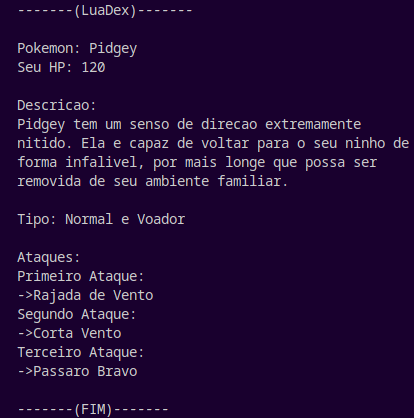

# POKELUADEX

 **O que é este projeto?**
> Explicação minimalista!
- O projeto tem como objetivo ser uma base para criação de uma Pokedex desenvolvida em Lua, qualquer outro desenvolvedor pode modificar e adicionar outros Pokemons, inclusive usando as bases dos que já existem, assim como aprimoramentos do sistema que de início foi feito para ser simples e eficiente sem tanta verbosidade em seu código fonte.

 **Quais Pokémons estão adicionados?**
> Existem 4 Pokémons por padrão!
-  Charmander
-  Bulbasaur
-  Squirtle
-  Pidgey

 **Como funciona a visualização?**
> PrintScreen do Console!
- Abaixo temos uma representação de como é mostrada a Pokedex do Pokémon, você consegue ver algumas informações como ``(Nome, Vida, Tipo, Descrição, Primeiro, Segundo e Terceiro ataque)`` e novas informações podem ser adicionadas também.

 **Descrição dos Pokémons**: https://www.heypikachu.com
 **Imagem dos Pokémons**: https://br.pinterest.com/
